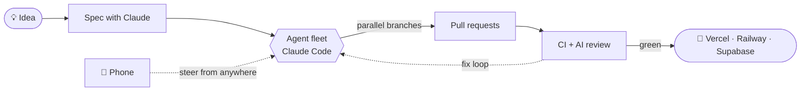

<!-- Header: animated SVG that follows GitHub's light/dark theme. Source: scripts/hero.py -->
<picture>
  <source media="(prefers-color-scheme: dark)" srcset="assets/hero-dark.svg">
  <source media="(prefers-color-scheme: light)" srcset="assets/hero-light.svg">
  
</picture>

<p align="center">
  <a href="https://github.com/tha6unn">
    
  </a>
</p>

<p align="center">
  <a href="https://www.linkedin.com/in/tha6un/"></a>
  
</p>

---

### `> whoami`

```ts
const tharun = {
  role:       "Founder, Madhigen Technologies",
  builds:     ["B2B SaaS", "tools for engineers", "agent-powered workflows"],
  stack:      { web: ["Next.js", "React", "TypeScript", "Tailwind"],
                backend: ["Python", "FastAPI", "Supabase", "PostgreSQL"],
                ai: ["Claude", "Claude Code", "Agent SDK", "computer vision"] },
  superpower: "shipping a product with a team of AI agents in the time it takes to write the spec",
  based:      "India (UTC+5:30)",
  ask_me:     "how to run a company where most of the code is written by agents",
};
```

### 🚀 What I'm building

<p><b>🏢 Madhigen Technologies</b> <sub><code>founder</code></sub><br>
A product studio building AI-first software for real businesses.</p>

<table>
  <tr>
    <td width="33%" valign="top">
      <h4>🔒 B2B SaaS</h4>
      <p>Secure, multi-tenant platforms for real businesses, built privacy-first from day one.</p>
      <sub><code>Next.js</code> <code>Postgres</code> <code>Security</code></sub>
    </td>
    <td width="33%" valign="top">
      <h4>🛠️ Engineering tools</h4>
      <p>Desktop software that takes slow, error-prone manual checks off engineers' plates.</p>
      <sub><code>Python</code> <code>Desktop</code> <code>Automation</code></sub>
    </td>
    <td width="33%" valign="top">
      <h4>🤖 Agent tooling</h4>
      <p>In-house tools that let a small team ship like a big one with a fleet of AI agents.</p>
      <sub><code>Claude Agent SDK</code> <code>FastAPI</code> <code>PWA</code></sub>
    </td>
  </tr>
</table>

<sub>🤫 Products are in private development. Public launches will be announced here.</sub>

### 🤖 How I ship: AI-native, end to end



<sub>I treat AI agents like a team: I write the spec, they draft the code, CI and reviews keep everyone honest, and I make the calls.</sub>

### 🧰 Toolbox

<p align="center">
  <picture>
    <source media="(prefers-color-scheme: dark)" srcset="https://skillicons.dev/icons?i=ts,js,python,react,nextjs,tailwind,nodejs,fastapi,supabase,postgres,vercel,docker,githubactions,git,linux,figma,opencv,sklearn&perline=9&theme=dark">
    
  </picture>
</p>

<p align="center">
  
  
  
  
  
  
</p>

### 📈 By the numbers

<!-- Cards below are generated daily by scripts/cards.py and published to the `output` branch. -->
<p align="center">
  <picture>
    <source media="(prefers-color-scheme: dark)" srcset="https://raw.githubusercontent.com/tha6unn/tha6unn/output/stats-dark.svg">
    
  </picture>
  <picture>
    <source media="(prefers-color-scheme: dark)" srcset="https://raw.githubusercontent.com/tha6unn/tha6unn/output/streak-dark.svg">
    
  </picture>
</p>
<p align="center">
  <picture>
    <source media="(prefers-color-scheme: dark)" srcset="https://raw.githubusercontent.com/tha6unn/tha6unn/output/activity-dark.svg">
    
  </picture>
</p>
<p align="center">
  <picture>
    <source media="(prefers-color-scheme: dark)" srcset="https://raw.githubusercontent.com/tha6unn/tha6unn/output/languages-dark.svg">
    
  </picture>
</p>

<p align="center">
  <picture>
    <source media="(prefers-color-scheme: dark)" srcset="https://raw.githubusercontent.com/tha6unn/tha6unn/output/github-snake-dark.svg">
    
  </picture>
</p>

### 🛠️ Recently shipped in public

<!-- LIVE:RECENT:START -->
| Repo | What it is | Lang | Pushed |
|---|---|---|---|
| [**Real-time-Face-Detection-with-Latency-and-FPS-Calculation**](https://github.com/tha6unn/Real-time-Face-Detection-with-Latency-and-FPS-Calculation) | This project demonstrates real-time face detection using OpenVINO (Open Visual Inferenc… | Python | 2 yr ago |
| [**Watch-and-Mobile-Phone-Detector-using-OpenVINO**](https://github.com/tha6unn/Watch-and-Mobile-Phone-Detector-using-OpenVINO) | This project demonstrates the use of OpenVINO (Open Visual Inference and Neural Network… | Python | 2 yr ago |
| [**Flower-Type-Classifer-using-OpenVINO**](https://github.com/tha6unn/Flower-Type-Classifer-using-OpenVINO) | This project demonstrates the use of OpenVINO (Open Visual Inference and Neural Network… | Python | 2 yr ago |
| [**Fake-news-prediction**](https://github.com/tha6unn/Fake-news-prediction) | This project aims to predict whether a news article is fake or real using machine learn… | Python | 2 yr ago |
| [**Diabetes-Prediction**](https://github.com/tha6unn/Diabetes-Prediction) | &quot;Diabetes Prediction&quot; is a machine learning model developed to predict the risk of diab… | Python | 2 yr ago |
<!-- LIVE:RECENT:END -->

<details>
<summary><b>🧪 Earlier experiments: ML and computer vision</b></summary>
<br>

| Project | Notes |
|---|---|
| [Diabetes-Prediction](https://github.com/tha6unn/Diabetes-Prediction) | ML model predicting diabetes risk |
| [Fake-news-prediction](https://github.com/tha6unn/Fake-news-prediction) | NLP classifier for fake news |
| [Watch & Phone Detector](https://github.com/tha6unn/Watch-and-Mobile-Phone-Detector-using-OpenVINO) | Real-time object detection with OpenVINO |
| [Flower Classifier](https://github.com/tha6unn/Flower-Type-Classifer-using-OpenVINO) | Image classification with OpenVINO |
| [Real-time Face Detection](https://github.com/tha6unn/Real-time-Face-Detection-with-Latency-and-FPS-Calculation) | Face detection with latency and FPS metrics |

</details>

### 🤝 Let's build

I like hard problems, fast feedback loops and teams that ship. If you're a founder or a business with a workflow begging to be automated, **[say hi on LinkedIn](https://www.linkedin.com/in/tha6un/)**.

<picture>
  <source media="(prefers-color-scheme: dark)" srcset="assets/footer-dark.svg">
  
</picture>

<p align="center">
<!-- LIVE:UPDATED:START -->
<sub>Live sections refreshed by GitHub Actions · last run 7 Oct 2026, 05:54 UTC</sub>
<!-- LIVE:UPDATED:END -->
</p>
